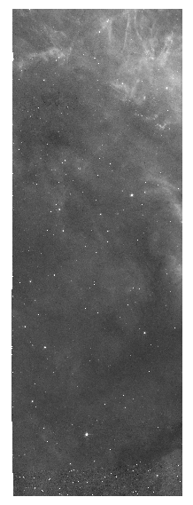
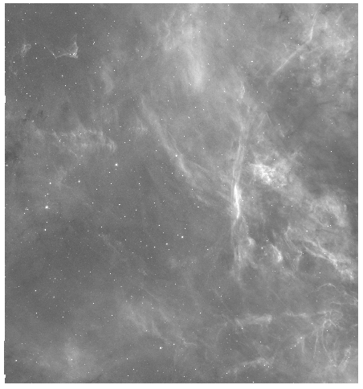
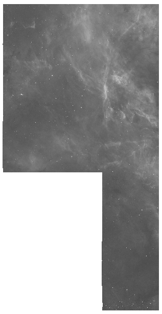
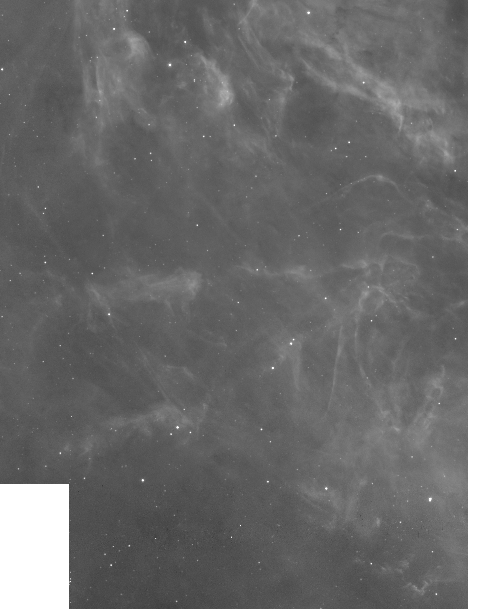

.. _mvmutilities:

=======================================
Utilities for Manipulating MVM Products
=======================================
.. toctree::
   :maxdepth: 2

The `~drizzlepac.haputils.hapcut_utils` module contains utilities which are intended to be used with
Multi-visit Mosaic (MVM) data and to be imported into other Python programs or
a Python session for interactive data analysis.  The utilities are wrappers
around lower-level functionality which actually perform the core tasks.
The core tasks referenced here are `astroquery <https://astroquery.readthedocs.io/en/latest/>`_, 
used for MAST inquiries and retrievals, 
and `astrocut <https://astrocut.readthedocs.io/en/latest/astrocut/index.html>`_, 
used to create the cutouts and cutout combinations.
The `~drizzlepac.haputils.hapcut_utils` role is to customize the use of these core
tasks specifically for working with MVM products which can be large and unwieldy.
At this time there are four utilities which are designed to be invoked in
sequence as is evident from their function signatures, return values, and output
products:
``mvm_id_filenames``, ``mvm_retrieve_files``, ``make_the_cut``, and ``mvm_combine``.

A brief overview of the utilities is described in this list.

  #. ``mvm_id_filenames``: Query MAST to identify all MVM files which overlap the specified cutout region on the sky
  #. ``mvm_retrieve_files``: Download all requested MVM files from MAST to the working directory
  #. ``make_the_cut``: Extract cutouts from all specified MVM files
  #. ``mvm_combine``: Create a mosaic from the specified cutouts that span multiple SkyCells and fit the qualifications

MVM Cutout Utilities
--------------------

mvm_id_filenames
^^^^^^^^^^^^^^^^
This utility is invoked by providing sky coordinates and
a cutout box size.  The sky coordinates represent the central location
about which the search for data of interest is to be done.  The cutout
box size represents the search box *extent* encompassing the sky coordinates.
The utility retrieves from MAST a table containing MVM filenames for ACS and 
WFC3 detectors, as well as other relevant image specific information, one 
row per filename.  While the utility returns an astropy table object, an ascii
ECSV file is also written to disk with the output filename being constructed
from the query coordinates and box size parameters.  The output filename is of
the form::

  mvm_query-ra<###>d<####>-dec<n|s><##>d<####>_<radius>_cutout.ecsv 

The ``ra<###>d<####>`` and ``dec<n|s><##>d<####>`` are the right ascension and
declination, respectively, in decimal degrees with ``<n|s>`` representing north or
south of the celestial equator. The ``<radius>`` is the computed diagonal
of the cutout box which is basically the square root of the sum of the box sides
squared divided by two.  

The in-memory table or the ascii file can be refined
by the user to suit specific needs.  The MVM filenames within the query file are
self-descriptive.  The filter-level drizzled filename is of the form::

  hst_skycell-p<PPPP>x<XX>y<YY>_<instr>_<detector>_<filter>_<label>_dr[cz].fits

where ``-p`` is followed by the four digit projection cell value, and ``x`` and ``y``
are each followed by a two digit sky cell value.  The possible ``label`` values
at this time are ``all`` or ``coarse-all`` where ``all`` indicates all exposures while
``coarse-all`` indicates all the exposures at a coarse platescale
(i.e., the WFC3/IR platescale of 0.12"/pixel) in the visit were used in the 
generation of the product.

While the standard pipeline processing does not generate MVM exposure-level,
drizzled products, the user can activate this capability when performing custom
processing.  As such, the MAST query will not contain any exposure-level drizzled
product filenames.  However, an example of an exposure-level drizzled filename 
created by custom processing would be of the form::

  hst_skycell-p<PPPP>x<XX>y<YY>_<instr>_<detector>_<filter>_<label>-ipppssoo_dr[cz].fits

An example of a real MVM filter-level, drizzled filename is::

  hst_skycell-p0081x14y14_wfc3_uvis_f225w_all_drc.fits

mvm_retrieve_files
^^^^^^^^^^^^^^^^^^
This utility is designed to use the in-memory table generated by ``mvm_id_filenames``
and retrieve any file listed in the table from MAST.  Since the images can be quite
large, the ``clobber`` parameter is set to False by default, indicating
no download is done for a filename that already exists on disk.  The utility returns
a Python list of filenames on disk available for further analysis.

make_the_cut
^^^^^^^^^^^^
The ``make_the_cut`` utility will perform the FITS cutouts on the input MVM
filter- and exposure-level images.  This MVM customized utility is layered
on ``fits_cut``, a function which is part of Astrocut, a Python package for
making astronomical cutouts (https://astrocut.readthedocs.io/en/latest/). The
``make_the_cut`` function is invoked
by providing the list of files on disk for which one wants to make cutouts, as
well as the sky coordinates, and the cutout box size.  Ideally, the
sky coordinates and cutout box size are the same values used for the
``mvm_id_filenames`` utility.  For each input file designated for a cutout,
there will be a corresponding output file.  Since both the SCI and WHT
extensions of the input files are actually cut, individual output cutout FITS
files will contain two image extensions, a SCI followed by a WHT.  The
cutouts are explicitly generated by looping over the input file list in case one 
of the files experiences an exception so the remaining files in the list still 
have the opportunity to create a cutout.
Each filter-level output filename will be of the form::

   hst_cutout_skycell-p<pppp>-ra<##>d<####>-dec<n|s><##>d<####>_instrument_detector_filter[_platescale].fits

Each exposure-level filename generated by custom user processing will be of the form::

   hst_cutout_skycell-p<pppp>-ra<##>d<####>-dec<n|s><##>d<####>_instrument_detector_filter[_platescale]-ipppssoo.fits

The components of the output filename follow the pattern discussed for
``mvm_id_filenames``. The additional ``platescale`` component has
the possible value of ``coarse``.  When there is no ``platescale`` component present
in the filename, the ``platescale`` has the implicit default value of ``fine``.
The ``fine`` platescale is 0.04"/pixel and is the standardized platescale for all
MVM products.  The platescale of ``coarse`` is only applicable to the WFC3/IR data.

The primary header data unit (PHDU) from the input file is retained 
as the PHDU for the output cutout file with an updated FILENAME keyword
and a few additional keywords.  The new keywords
RA_OBJ/DEC_OBJ were added by the Astrocut utility representing the right ascension
and declination of the object in decimal degrees.  Another new keyword is ORIG_FLE
which represents the original input filename from which the cutout was extracted.
In each output file, the image extensions have been explicitly named for
for clarity.

.. code-block:: python 

   >>> from astropy.io import fits
   >>> hdu= fits.open("hst_cutout_skycell-p0081x14y15-ra84d8208-decs69d8516_wfc3_uvis_f275w.fits")
   >>> hdu.info()
   Filename: hst_cutout_skycell-p0081x14y15-ra84d8208-decs69d8516_wfc3_uvis_f275w.fits
   No.    Name      Ver    Type      Cards   Dimensions   Format
     0  PRIMARY       1 PrimaryHDU     872   ()      
     1  SCI           1 ImageHDU       106   (12500, 12500)   float32   
     2  WHT           1 ImageHDU        56   (12500, 12500)   float32  

mvm_combine
^^^^^^^^^^^
The final MVM utility at this time is ``mvm_combine`` and is designed to combine filter-level
cutout images originating from multiple skycells where all the images were acquired with the same
detector and using the same filter.  The utility will also combine exposure-level cutout
images from multiple skycells where the images were acquired with the same
detector, using the same filter, and sharing the same ipppssoo and created by user custom
processing.  Put more straightforwardly,
the cutout images must have originated from the same MVM drizzled image which spanned
the border between multiple skycells.  Cutout images in the
input list which do not adhere to these noted requirements will trigger a message of
explanation and be ignored for the combination process.

The ``mvm_combine`` utility is invoked by providing a list of cutout files, and the utility
will handle segregating the files into filter- and exposure-level sets and determining
whether or not the cutout file is eligible for the combination process.  Once all the
input images have been prepared, the mvm_combine will call the `Astrocut function
<https://astrocut.readthedocs.io/en/latest/astrocut/index.html#combining-cutouts>`_
``CutoutsCombiner``
to handle the actual combination task.  At this time, only the default
*mean* combiner is available for use where every output pixel is the mean of all input
pixels that have data at that point.

Since both the SCI and WHT extensions of the input files are combined, individual
output combined FITS files will contain two image extensions, a SCI followed by a WHT.
The utility writes to the specified output directory one combined file per set of
compatible images.  The output filenames are constructed from the RA, Dec, instrument, detector,
filter, and exposure as appropriate.
Each filter-level output filename will be of the form::

   hst_combined_skycell-ra<##>d<####>-dec<n|s><##>d<####>_instrument_detector_filter.fits

Each exposure-level filename where the cutout images were generated by custom user
processing will be of the form::

   hst_combined_skycell-ra<##>d<####>-dec<n|s><##>d<####>_instrument_detector_filter_ipppssoo.fits

The keyword, FILENAME, has been added to the PHDU to self-document the
name of the file.
The Extension Header Data Units (EHDUs) contain custom keywords which document the
filenames and extension names of the originating files.  These custom keywords are
created by the ``CutoutsCombiner`` and are of the form ``Fnn_[K|V|C]mm`` representing the
keywords EXTNAMEs and ORIG_FLEs from the input cutout files. The ``nn`` represents the
header number, and ``mm`` represents a count of the custom keywords.
For example,

.. code-block:: python 

   >>> hdu = fits.open("hst_combined_skycells-ra84d9402-decs69d8514_acs_wfc_f658n.fits")
   >>> hdu.info()
   Filename: hst_combined_skycells-ra84d9402-decs69d8514_acs_wfc_f658n.fits
   No.    Name      Ver    Type      Cards   Dimensions   Format
     0  PRIMARY       1 PrimaryHDU      10   ()      
     1  SCI           1 ImageHDU       167   (250, 250)   float64   
     2  WHT           1 ImageHDU        70   (250, 250)   float64   

   where the first extention or combined SCI extension header contains
   O_EXT_NM= 'SCI     '           / Original extension name.                       
   ORIG_EXT=                    1 / Extension in original file.                    
   F01_K01 = 'EXTNAME '           / Keyword                                        
   F01_V01 = 'SCI'                / Value                        
   F01_C01 = 'extension name'     / Comment                                        
   F02_K01 = 'EXTNAME '           / Keyword                                        
   F02_V01 = 'SCI'                / Value                        
   F02_C01 = 'extension name'     / Comment      
   F01_V02 = 'hst_skycell-p0081x14y15_acs_wfc_f658n_all_drz.fits' / Value          
   F01_C02 = 'Original image'     / Comment                                        
   F02_K02 = 'ORIG_FLE'           / Keyword                                        
   F02_V02 = 'hst_skycell-p0081x14y14_acs_wfc_f658n_all_drc.fits' / Value          
   F02_C02 = 'Original image'     / Comment                                        
   EXTNAME = 'SCI'    

and similarly for the second or combined WHT extension.

A Full Worked Example
---------------------

In the example below, the ellipses ("...") are used to indicate the omission of output
similar to what has already been documented for the reader.  Note that as of this writing,
there are actually no MVM files in MAST upon which to perform a query or request a
retrieval so details on output messages may vary from the true output.

.. code-block:: python 

   >>> from drizzlepac.haputils import hapcut_utils as hu
   >>> from astropy.coordinates import SkyCoord
   >>> query_table = hu.mvm_id_filename(SkyCoord(84.9208, -69.1467, unit="deg"), [256, 256]) 
   2021295152553 INFO src=hapcut- Radius for query: 182.0 arcsec.
   2021295152553 INFO src=hapcut- Performing query for ACS images.
   2021295152621 INFO src=hapcut- Performing query for WFC3 images.
   2021295152646 INFO src=hapcut- Get the product list for all entries in the query table.
   2021295152646 INFO src=hapcut- Filter the product list table for only ['DRZ', 'DRC'] filenames.
   2021295152646 INFO src=hapcut- Writing out the MVM product list table to mvm_query-ra84d9207-decs69d1467_182_cutout.ecsv.
   2021295152646 INFO src=hapcut- Number of entries in table: 26.

The ``mvm_retrieve_files`` simply gets the requested files, in this case every file in the
query_table, from MAST unless the files are already found to be resident on disk.  It should be
noted any individual MVM file could be rather large and unwieldy.

.. code-block:: python 

   >>> requested_files = hu.mvm_retrieve_files(query_table)

The ``make_the_cut`` function loops over the input list of files and tries to make the
requested cutout.  If a cutout cannot be made, an error message will be generated, and
the function will continue processing.  All cutout files have the prefix ``hst_cutout``.

.. code-block:: python 

   >>> cutout_files = hu.make_the_cut(requested_files, SkyCoord(84.9208, -69.1467, unit="deg"), [256, 256])
   Number of input files: 1
   Cutting out [1, 2] extension(s)
   Center coordinate: 84.9208 -69.1467 deg
   Cutout size: [256. 256.] arcsec

   Cutting out hst_skycell-p0081x14y14_acs_wfc_f658n_all_drc.fits
   Original image shape: (21953, 11503)
   xmin,xmax: [ 8093 14493]
   ymin,ymax: [18554 24954]
   Image cutout shape: (6400, 6400)
   Original image shape: (21953, 11503)
   xmin,xmax: [ 8093 14493]
   ymin,ymax: [18554 24954]
   Image cutout shape: (6400, 6400)
   Returning cutouts as individual FITS
   Total time: 4.3 sec

   ...

   2021295103421 INFO src=hapcut- Cutout FITS filename: ./hst_cutout_skycell-p0081x14y14-ra84d9207-decs69d8533_wfc3_ir_f110w_coarse-iby03fg6.fits
   2021295103422 INFO src=hapcut- Cutout FITS filename: ./hst_cutout_skycell-p0081x14y14-ra84d9207-decs69d8533_acs_wfc_f658n.fits

The ``mvm_combine`` function loops over the input list of cutout files and organizes the 
data according to instrument/detector and filter for filter-level combinations.  The data is
organized by instrument/detector, filter, and ipppssoo for exposure-level combinations.
Images in the input list  which do not share an instrument/detector and filter with any other 
image will be ignored. Individual exposures from a single skycell will also be ignored.

.. code-block:: python 

   >>> hu.mvm_combine(cutout_files)
   2021295104231 INFO src=hapcut- Input cutout files:
   2021295104231 INFO src=hapcut- File: hst_cutout_skycell-p0081x14y14-ra84d9207-decs69d8533_acs_wfc_f555w-jby001r0.fits
   2021295104231 INFO src=hapcut- File: hst_cutout_skycell-p0081x14y14-ra84d9207-decs69d8533_acs_wfc_f555w.fits
   2021295104231 INFO src=hapcut- File: hst_cutout_skycell-p0081x14y15-ra84d9207-decs69d8533_acs_wfc_f814w-jbp505jg.fits
   2021295104231 INFO src=hapcut- File: hst_cutout_skycell-p0081x14y15-ra84d9207-decs69d8533_acs_wfc_f814w.fits

   ...

   2021295104231 INFO src=hapcut- === Combining filter-level files ===
   2021295104231 WARNING src=hapcut- There is only one file for this detector/filter[/ipppssoo] combination, so there is nothing to combine.
   2021295104231 WARNING src=hapcut- File ['hst_cutout_skycell-p0081x14y14-ra84d9207-decs69d8533_acs_wfc_f555w.fits'] will be ignored for combination purposes.

   2021295104231 WARNING src=hapcut- There is only one file for this detector/filter[/ipppssoo] combination, so there is nothing to combine.
   2021295104231 WARNING src=hapcut- File ['hst_cutout_skycell-p0081x14y15-ra84d9207-decs69d8533_acs_wfc_f814w.fits'] will be ignored for combination purposes.

   2021295104231 INFO src=hapcut- Combining the SCI and then the WHT extensions of the input cutout files.
   2021295104237 INFO src=hapcut- The combined output filename is ./hst_combined_skycells-ra84d9207-decs69d8533_acs_wfc_f658n.fits.

   ...

   2021295104242 INFO src=hapcut-
   2021295104242 INFO src=hapcut- === Combining exposure-level files ===
   2021295104242 WARNING src=hapcut- There is only one file for this detector/filter[/ipppssoo] combination, so there is nothing to combine.
   2021295104242 WARNING src=hapcut- File ['hst_cutout_skycell-p0081x14y14-ra84d9207-decs69d8533_acs_wfc_f555w-jby001r0.fits'] will be ignored for combination purposes.

   ...

   2021295104242 INFO src=hapcut- Combining the SCI and then the WHT extensions of the input cutout files.
   2021295104246 INFO src=hapcut- The combined output filename is ./hst_combined_skycells-ra84d9207-decs69d8533_wfc3_ir_f110w_iby03fg4.fits.

   ...

   2021295104255 INFO src=hapcut- Cutout combination is done.

   This cutout is hst_cutout_skycell-p0081x14y14-ra84d9207-decs69d8533_acs_wfc_f658n.fits scaled in size by 75%.  The region in common with skycell-p0081x14y15 is in the upper-right corner.

   This cutout is hst_cutout_skycell-p0081x14y15-ra84d9207-decs69d8533_acs_wfc_f658n.fits scaled in size by 75%.  The region in common with skycell-p0081x14y14 is in the lower-right corner.

   This figure is the combination of the two cutouts scaled in size by 75%.

   Finally, this figure is the combination of the two cutouts scaled in size by 75% and zoomed in to the overlap region.

