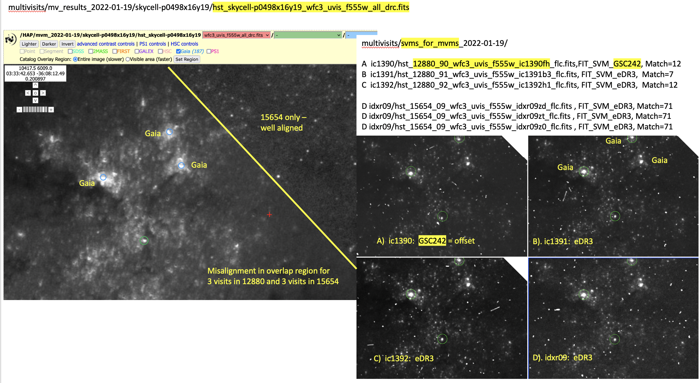
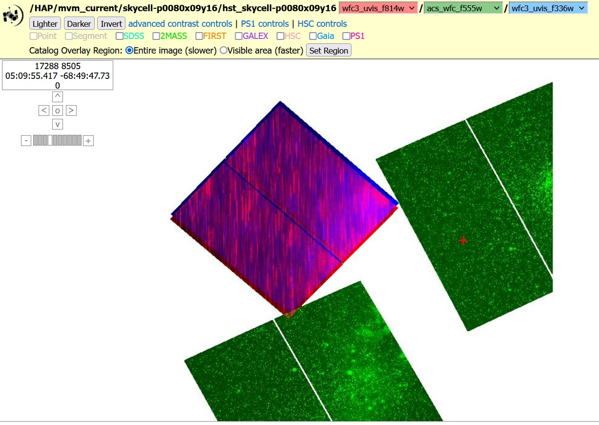

.. _multivisit_products:

=============================
Multi-visit Mosaic Products
=============================

Multi-Visit Mosaic (MVM)
    A Multi-Visit Mosaic (MVM) is a single image (product) made by combining all observations taken of the same part of the sky.

Observations taken of the same part of the sky over all the years that HST has been operational can enable unique science
due to the high-resolution of the HST cameras.  Generating useful mosaics from these observations, though, requires
solving a number of key problems; namely,

  * aligning all the images to the same coordinate system
  * define the size on the sky of each mosaic
  * defining what exposures should go into each mosaic

MVM processing implemented as part of the Hubble Advanced Products (HAP) pipeline generates new products based on
solutions implemented for these critical issues.  These new products, SkyCell layers, are unlike other HST images
due to the fact that
they consist of many exposures taken at different times, sometimes years apart.  The format of these products and
the new aspects of these products are described in the following sections.

SkyCell Layers
===============
The most basic MVM product would be the SkyCell layer as described in
:ref:`Defining SkyCell Layers<defining_skycells>` section.  These layers
represent all the exposures taken in a given detector/filter combination in that SkyCell (position on the sky).  As a
example, the exposures for sky cell **p1889x07y19** define 9 separate layers; namely,

  ==========================  =============  ============================================================
  Layer Name                  Plate scale    SkyCell filename
  ==========================  =============  ============================================================
  **wfc3_uvis_f475w**         0.04"/pixel    hst_skycell-p1889x07y19_wfc3_uvis_f475w_all_drz.fits
  **wfc3_ir_f105w_coarse**    0.12"/pixel    hst_skycell-p1889x07y19_wfc3_ir_f105w_coarse-all_drz.fits
  **wfc3_ir_f105w**           0.04"/pixel    hst_skycell-p1889x07y19_wfc3_ir_f105w_all_drz.fits
  **wfc3_ir_f125w_coarse**    0.12"/pixel    hst_skycell-p1889x07y19_wfc3_ir_f125w_coarse-all_drz.fits
  **wfc3_ir_f125w**           0.04"/pixel    hst_skycell-p1889x07y19_wfc3_ir_f125w_all_drz.fits
  **wfc3_ir_f160w_coarse**    0.12"/pixel    hst_skycell-p1889x07y19_wfc3_ir_f160w_coarse-all_drz.fits
  **wfc3_ir_f160w**           0.04"/pixel    hst_skycell-p1889x07y19_wfc3_ir_f160w_all_drz.fits
  **acs_wfc_f850lp**          0.04"/pixel    hst_skycell-p1889x07y19_acs_wfc_f850lp_all_drc.fits
  **acs_wfc_f775w**           0.04"/pixel    hst_skycell-p1889x07y19_acs_wfc_f775w_all_drc.fits
  ==========================  =============  ============================================================

A full SkyCell would cover an area on the sky of approximately 0.2\deg x 0.2\deg with a WCS defined as:

.. code-block::

    Number of WCS axes: 2
    CTYPE : 'RA---TAN'  'DEC--TAN'
    CRVAL : 180.0  26.0
    CRPIX : 96492.0  -160812.0
    CD1_1 CD1_2  : -1.1111111111111112e-05  0.0
    CD2_1 CD2_2  : 0.0  1.1111111111111112e-05
    NAXIS : 21954  21954

SkyCell Subarray Specification
-------------------------------
SkyCell layers would normally result in arrays that take up 1.8Gb each, or nearly 4Gb for the entire FITS file.  In
addition, most of a typical SkyCell layer will be empty due to the small size of most detectors, especially the WFC3/IR,
ACS/HRC and ACS/SBC detectors which are only 1024x1024 arrays.  As a result, each SkyCell is evaluated to define only a common
subarray size that covers ALL HST data for the SkyCell regardless of the layer, then uses that to define the smallest
WCS specification possible for the SkyCell.  The data from **p1889x07y19** actually only covers about 1/4 of the entire
SkyCell resulting in a WCS defined as:

.. code:: python

    >>> wcs1889 = HSTWCS('hst_skycell-p1889x07y19_acs_wfc_f775w_all_drc.fits', ext=1)
    >>> print(wcs1889)

    WCS Keywords
    Number of WCS axes: 2
    CTYPE : 'RA---TAN'  'DEC--TAN'
    CRVAL : 180.0  26.0
    CRPIX : 94360.0  -171093.0
    CD1_1 CD1_2  : -1.1111111111111e-05  0.0
    CD2_1 CD2_2  : 0.0  1.11111111111111e-05
    NAXIS : 10840  11672

We can see how the exposures land in the SkyCell as defined with this subarray WCS.

.. list-table::

  * - .. figure:: ../images/skycell-p1889x07y19_f775w_full.jpg
         :figwidth: 95%
         :alt: SkyCell p1889x07y19 WFC3/UVIS F775W layer.

         All the WFC3/UVIS F775W exposures that overlap SkyCell **p1889x07y19**.

    -  .. figure:: ../images/skycell-p1889x07y19_f105w_full.jpg
          :figwidth: 95%
          :alt: SkyCell p1889x07y19 WFC3/IR F105W layer.

          All the WFC3/IR F105W exposures that overlap SkyCell **p1889x07y19**.

These figures demonstrate how the SkyCell subarray has been defined to cover only the exposures that overlap this
SkyCell while minimizing the amount of empty space in these layers making these products as small as possible without
resorting to compression.

.. note::
  These layers are defined as subarrays of the entire SkyCell WCS, which are just subarrays of the ProjectionCell.
  As a result, any position in these layers refers to the exact same position on the sky
  as defined in the SkyCell or ProjectionCell.  A source at (x,y)=(7936, 11133) will have the same sky coordinates
  regardless of what SkyCell layer it was measured in, including an array defined for the entire SkyCell.

File Format
============
The SkyCell layer mosaics get generated using AstroDrizzle using a custom set of rules for defining what
keywords go into the primary and science extension headers. These files have the same set of extensions
as all other drizzled products; namely, PRIMARY, SCI, WHT, CTX and HDRTAB.

MVM-specific keywords
---------------------
MVM mosaics, by definition, include the contributions of many exposures (in most cases) potentially taken
at many different times for a specific section of the sky.  Header keywords have been defined to provide
some information on the unique characteristics of these mosaics and the contribution of the exposures to
the mosaic.  This unique set of keywords defined in the PRIMARY headers of MVM mosaics includes:

    ===========    ================================================================================
    Keyword        Description
    ===========    ================================================================================
    SCELLID        ID of the SkyCell this mosaic covers
    NPIXFRAC       Fraction of pixels across the full SkyCell which has been observed by HST
    MEANEXPT       Mean exposure time of pixels which have been observed by HST
    MEDEXPT        Median exposure time of pixels which have been observed by HST
    MEANNEXP       Mean number of HST exposures for the pixels which have been observed by HST
    MEDNEXP        Median number of HST exposure for the pixels which have been observed by HST
    MEANWHT        Mean weight (typically exposure time) of pixels observed by HST
    MEDWHT         Median of weights (typically exposure time) of pixels observed by HST
    ===========    ================================================================================

In addition, some keywords typically found in standard pipeline product headers or the headers of SVM mosaics have
been removed from the headers of MVM products.  These deleted keywords can be found in the HDRTAB extension for each
of the input exposures, but make no sense for MVM products.  One example would be the 'IPPPSSOO' keyword which
gives the 'ipppssoo' value for a single exposure or association product the input exposures had, yet MVM mosaics
consist of multiple inputs with many different values of 'ipppssoo'.  The full list of keywords which were removed can
be found in the HISTORY keywords of the MVM product PRIMARY header where the rules file used for defining the MVM
headers gets reported.

Artifacts
==========
There are a number of issues that can arise when generating SkyCell mosaics.  Every effort is made during pipeline
processing to minimize or avoid these issues where possible, but some mosaics are unavoidably affected by these issues.

Mis-alignment
--------------
One of the primary benefits of SkyCell mosaic image is learning how observations taken at different times and using
different filters relate to each other.  The mosaics all share the same pixel definitions which allow for direct
comparisons of the data across all the layers of a SkyCell.  However, the placement of the exposures in the SkyCell
depends on how the WCS was defined for each exposure.  Unfortunately, due to the objects in the field of view for an
exposure or the size of the field of view of the exposure, it may not be possible to align the exposure to the same
astrometric catalog as the rest of the exposures in the SkyCell.  This can lead to mis-alignment between the exposures
on the order of a few pixels.  If this mis-aligned exposure overlaps another exposure aligned to GAIA in a SkyCell mosaic,
then it can result in visible blurring or double-images in the final mosaic.

This can be seen when examining the SkyCell mosaic WFC3/UVIS F555W layer for SkyCell **p0498x16y19**.  The WCS has been
defined based on different astrometric catalogs for one of the visits of this source.  This results in
'blurred' sources being seen in the overlap between exposures from different visits.

         All the WFC3/UVIS F555W exposures that overlap SkyCell **p0498x16y19** illustrating
         how misalignment between visits can result in 'blurred' sources in region of overlap.
         [Image courtesy of J. Mack (STScI/ACS Instrument team)].

Loss of Lock
--------------
Another issue that can show up in SkyCell mosaics results from HST slewing across the sky while the exposure was
being taken.  This can happen when HST loses lock on the guide stars used to point the telescope or intentionally
when the proposer requested exposures be taken in 'SCAN' mode.  No reliable method currently exists to identify
such exposures prior to creating mosaics with them, resulting in exposures where the sources are trailed across
the image.

         SkyCell **p0080x09y16** mosaic showing the effects of loss of lock or SCAN mode data
         being included in the output image.

Fortunately, these observations stand out as very dramatic regions of the MVM mosaic where no recognizable sources can
be found, only a series of streaks as seen in the example.  There are some exposures where SCAN mode was used to observe
extremely bright sources, however, many of the examples in the archive are the result of unexpected tracking problems
by HST.

The best option for anyone wanting to explore the region affected by such observations would be to get the list of
exposures that contribute to the MVM mosaic and reprocess the SkyCell interactively without including the problematic
exposures.  Eventually, these observations may be removed from the archived products, but until that time comes,
manual reprocessing would be the suggested means for studying SkyCells affected by such exposures.

Alignment Accuracy Across the SkyCell
--------------------------------------
Every effort gets made to align all exposures to a GAIA-based coordinate system.
Some exposures, though, just can not be aligned (or aligned in an automated fashion) to the GAIA system due to any
number of reasons.  In addition, not all exposures can be aligned to the same GAIA-based catalog of sources as the
exposure may not include enough GAIA sources for alignment, but may contain sources measured by other projects (like
Pan-STARRS) that have been subsequently fit to the GAIA coordinate system.  This will result in a larger uncertainty
for the coordinates for those sources.  The best available WCS for any given exposure eventually gets defined by the
SVM processing performed by the HST calibration pipeline and these aligned products then get used as inputs to generate
the MVM mosaics.

MVM mosaics include as many exposures as possible but due to these reasons, a given MVM mosaic can contain exposures
fit to different astrometric catalogs.  Exposures which do not overlap other exposures in the MVM mosaic can only use
the WCS defined during SVM processing and that may not be the most accurate GAIA-based catalog available.  This can result
in errors in the relative alignment between those exposures and the rest of the exposures in the mosaic which have been
aligned to the most accurate catalog available.  These errors may not be large (less than a few pixels in nearly all cases),
but care must be taken to interpret the positions of sources across a SkyCell due to such effects.

Effects of Proper Motion
-------------------------
HST has been taking images for over 30 years, with ACS being active since 2002 and WFC3 having been installed in 2009.
As a result, there have been some fields which have been observed multiple times over those decades allowing HST with
it's high resolution to observe the stellar proper motions.  Any source with proper motions of a few milli-arcseconds
motion per year or more could potentially be observed moving when comparing images taken over the life of HST.  Such
sources can be found in observations of sources like nearby globular clusters (e.g., 47Tuc or Omega Cen) or open clusters
(like M35).

Unfortunately, this makes aligning images of such high proper motion sources difficult to interpret.  Measurements of proper
motions for each source have been included in the catalog information for sources in the GAIA-based astrometric
catalogs for all catalogs derived using GAIADR2 or later.  The HST images taken during the same visit are then aligned
to the GAIA-based catalog, using the GAIAeDR3 catalog by default through 2022 during the SVM processing.  This SVM
alignment generates a consistent fit for the proper motions at a single epoch.  These SVM-aligned exposures are then
used, without further alignment, to generate the final MVM mosaic of all exposures taken over the life of HST.  As a result,
each epoch represents a single snapshot of the sources at one time.  The sources in the field with large proper motions,
on the other hand, are not going to align as they have moved from one epoch.  This will result in those sources showing
up with smeared PSFs or even double-exposures in the final MVM mosaic image while the background sources
(typically background galaxies or globular clusters) will be well aligned.

These errors can actually be a good way to spot high proper motion sources for later study.  In addition, improvements
to the MVM processing code are being developed to allow for such fields to be processed such that observations taken at
different times end up in their own MVM mosaic rather than having all the exposures combined by default.  This would
enable more direct measurement of such high proper motion sources, eventually.  The initial set of MVM products available
through the archive, though, will be comprised of layers consisting of all exposures from all times for each
detector/filter combination as indicated by the 'all' in the final MVM product filename.