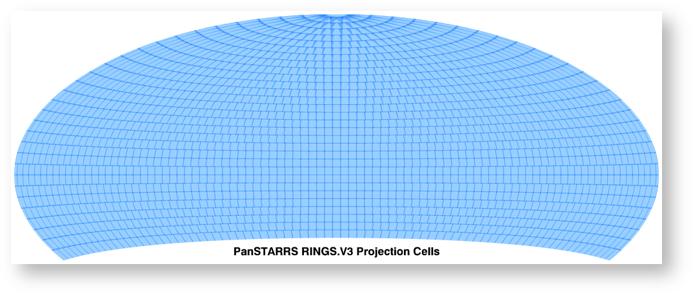

.. _multivisit:

=============================
Multi-visit Mosaic Processing
=============================

Multi-Visit Mosaic (MVM)
    A Multi-Visit Mosaic (MVM) is a single image (product) made by combining all observations taken of the same part of the sky.

Observations taken of the same part of the sky over all the years that HST has been operational can enable unique science
due to the high-resolution of the HST cameras.  Generating useful mosaics from these observations, though, requires
solving a number of key problems; namely,

  * aligning all the images to the same coordinate system
  * define the size on the sky of each mosaic
  * defining what exposures should go into each mosaic

MVM processing implemented as part of the Hubble Advanced Products (HAP) pipeline generates new products based on
solutions implemented for these critical issues.

Alignment
==========
Generating MVM products relies entirely on the definition of the WCS of each input image in order to define where each
exposure will land in the output mosaic.  Errors in an input exposure's WCS will lead to misalignment of overlapping
images resulting in smeared sources or even multiple images of the overlapping sources in the output mosaic.  Errors
in the WCS primarily stem from images being aligned to different astrometric catalogs.  For example,
one exposure may be aligned successfully to the GAIADR2 catalog, yet another overlapping exposure can only be aligned
to the 2MASS catalog due to the lack of GAIA sources in the offset exposure.

MVM processing relies entirely on the alignment that can be performed on the exposures during standard pipeline processing
and subsequently as part of the Single-Visit Mosaic (SVM) processing.  This allows each visit to be aligned to the most
accurate catalog available while taking into account the proper motions of the astrometric sources in the field based on
the date the exposures were taken in the visit.

By default, the most current GAIA catalog will
be used as the default astrometric catalog for aligning all exposures which typically results in images that are aligned
well enough to avoid serious misalignment artifacts in the regions of overlap. Unfortunately, due to the nature of some
of the fields observed by HST, not all exposures can be aligned to a GAIA-based
catalog using GAIA astrometric sources.  As a result, the sources used for alignment will have much larger errors on the
sky compared to the errors of GAIA astrometric sources which can lead to offsets from the GAIA coordinate system of a
significant fraction of an HST pixel (or even multiple HST pixels).  This will lead to artifacts in MVM products where
such exposures overlap other exposures aligned to other catalogs, especially GAIA-based catalogs.

Defining the Mosaic on the Sky
==============================
MVM products need to be defined in order to understand what input exposures will contribute to each mosaic.  The solution
implemented for HAP MVM products relies on tesselation of the entire sky using the same basic tiles defined by the
PanSTARRS project as described at `PanSTARRS Sky tessellation patterns
<https://outerspace.stsci.edu/display/PANSTARRS/PS1+Sky+tessellation+patterns>`_.

  Aitoff plot of all 2,009 PS1 projection cells for the 3PI survey.  The coverage extends from declination −30° to the
  north celestial pole.

  PS1 projection cells near the north celestial pole, where the image overlap is greatest due to convergence of the RA grid.
  The projection cells are 4°x4° in size and are on rings spaced by 4° in declination.

MVM processing uses these pre-defined projection cells after extending them to cover the entire sky
with cells that are actually 4.2°x4.2° in size and are on rings spaced by 4° apart in declination.  This provides
sufficient overlap to allow data from one projection cell to be merged with data from a neighboring cell if necessary.

All these definitions, including finely each ProjectionCell should be divided to define the SkyCells, are encoded in a
FITS table installed as part of the `drizzlepac` package:

    drizzlepac/pars/allsky_cells.fits

Defining each SkyCell
----------------------
Each projection cell is split into a grid of 21 x 21 'sky cells' which serves as the most basic MVM product generated
during MVM processing.  Sky cells are approximately 0.2degrees x 0.2degrees in size (~21500 x ~21500 pixels) and
they have the same WCS as the ‘projection cell’.  Each skycell gets identified by its position within the projection cell
as shown in this figure:

  Numbering convention for SkyCells within a Projection Cell used for naming the SkyCell.

This provides a way to uniquely identify any position on the sky that can be used as the basis for a unique filename for
all products generated from all the expsosures that overlap each SkyCell.

The WCS for each SkyCell gets defined as a subarray of the Projection cell's WCS.  This allows data across SkyCells in
the same projection cell to be combined into larger mosaics as part of the same tangent plane without performing any
additional resampling.

Code for Defining SkyCell ID
'''''''''''''''''''''''''''''
The code for interfacing with the cell definitions table can be imported in Python using:

.. code:: python

   from drizzlepac.haputils import cell_utils

Determining what sky cells overlap any given set of exposures on the sky can be done using the function:

.. code:: python

  sky_cells_dict = cell_utils.get_sky_cells(visit_input, input_path=None)

where **visit_input** is the Python list of filenames of exposures.
Exposures in an input list are assumed to be in the current working directory when running the code,
unless **input_path** has been provided which points to the location of the exposures to be processed.
The return value **sky_cells_dict** is a dictionary where the keys are the names (labels) of each overlapping sky cell
and the value is the actual SkyCell object which contains the footprint and WCS (among other details) of the sky cell.

Defining SkyCell Layers
------------------------
Defining the SkyCell for a region on the sky allows for the identification of all exposures that overlap that WCS.
However, creating a single mosaic from data taken with different detectors and filters would not result in a
meaningful result.  Therefore, the exposures that overlap each SkyCell get grouped based on the detector and filter used
to take the exposure to define a 'layer' of the SkyCell.  Each layer can then be generated as the primary basic image
product for each SkyCell.  Exposures taken with spectroscopic elements, like grisms and prisms, and exposures taken of
moving targets can not be used to create layers due to the inability to align them with the rest of the observations.
Therefore, only images taken with standard filters (like the WFC3/UVIS F275W filter) will be used to define SkyCell
mosaics (layers).

The default plate scale for all MVM image products for each SkyCell has been defined as 0.04"/pixel to match the higher
resolution imaging performed by the WFC3/UVIS detector.  However, WFC3/IR data suffers from serious resampling artifacts
when drizzling IR data to that plate scale. So in addition to creating IR mosaics at the 0.04"/pixel 'fine' plate scale,
IR mosaics are also generated at a 'coarse' plate scale of 0.12"/pixel to minimize the resampling artifacts while also being easily
scaled to the 'fine' plate scale mosaics.

SkyCell Example
'''''''''''''''
For example, observations have been taken of NGC5474 with both the ACS and WFC3 cameras.  The ACS observations were taken
with the ACS/WFC detector using the F814W and F606W filters, while the WFC3 observations were taken using the IR detector
using the F110W and F160W filters.  All these observations fall within the SkyCell at position X06y11 in the
projection cell p2381, but given the dramatic plate scale differences, these observations can not be used to create a
single mosaic.  Instead, 6 separate layers get defined for this SkyCell; namely,

  * acs_wfc_f814w  (0.04"/pixel)
  * acs_wfc_f606w  (0.04"/pixel)
  * wfc3_ir_f110w  (0.04"/pixel)
  * wfc3_ir_f160w  (0.04"/pixel)
  * wfc3_ir_f110w_coarse  (0.12"/pixel)
  * wfc3_ir_f160w_coarse  (0.12"/pixel)

Since they all have the same WCS, modulo the plate scale differences, they can be overlaid pixel-by-pixel with each other for
analysis.

MVM Processing Steps
====================
The definitions for the ProjectionCell and SkyCell allow for all HST observations to be processed into a logical set of
image mosaic products regardless of how many observations cover any particular spot on the sky while tying them all
together in the same astrometric reference frame (as much as possible, anyway).  The steps taken to generate these
MVM products can be summarized as:

  * Determine what SkyCell or set of SkyCells each exposure overlaps
  * Copy all relevant exposures for a given SkyCell into a single directory for that SkyCell
  * Rename input exposures to have MVM-specific filenames
  * Generate input file to be used for processing each SkyCell
  * Evaluate all input exposures to define all layers needed for the SkyCell
  * Determine which layer to process
  * Drizzle all exposures for each layer to be processed to create new mosaic product for that layer

SkyCell Membership
------------------
Data from HST gets orgranized based on a filename derived from the proposal used to define the observations and how
HST should take them.  MVM processing, on the other hand, focuses on how the observations relate to each other on the
sky based on the WCS information.  The `drizzlepac/haputils/cell_utils.py` module includes the code used to interpret
the WCS information for exposures and determine what ProjectionCells and SkyCells each exposure overlaps as shown in the
section on the `Code for Defining SkyCell ID`_.

This code can be called on any set of user-defined exposures to either determine for the first time what SkyCells the
exposures overlap.  During HST pipeline processing, this code gets called for the exposures from each visit once they
have finished SVM processing and aligned the data as much as possible to the latest astrometric reference frame (such
as the GAIAeDR3 catalog).

Copy Data
----------
The MVM processing code requires the input exposures to be located in the current working directory as the processing may
require the ability to update the input files with the results of the MVM processing.  Each input file may also overlap
more than 1 SkyCell.  As a result, the input files get copied into a directory set up specifically for processing a
given SkyCell.  This results in each input file being copied into as many directories as needed to support creating the mosaics
for as many SkyCells as desired while protecting the integrity of the original input files and their WCS solutions.

Rename Input Files
-------------------
The MVM processing code works on the input files provided using the WCS solutions defined in the headers of the input
files as-is for the initial implementation.  However, in order to preserve the solutions defined by previous processing
steps, these files are renamed based on the SkyCell to be generated in the current working directory.

For reference, the original pipeline-assigned name has the format of:

  `IPPPSSOOT_flc.fits`

such as
  * jcz906dvq_flc.fits
  * icz901wpq_flc.fits

The MVM filename defined for the input exposures follows the convention.

  `hst_skycell-p<PPPP>x<XX>y<YY>_<instr>_<detector>_<filter>_<ipppssoo>_fl[ct].fits`

where:
  ==========  =========================================================================
  Element     Definition
  ==========  =========================================================================
  <PPPP>      ProjectionCell ID as a zero-padded 4 digit integer
  <XX>,<YY>   SkyCell ID within ProjectionCell as zero-padded 2 digit integers
  <instr>     Name of HST instrument from **INSTRUME** header keyword
  <detector>  Name of detector from **DETECTOR** header keyword
  <filter>    Name of filter from **FILTER** or **FILTER1,FILTER2** header keyword(s)
  <ipppssoo>  Pipeline-assigned **IPPPSSOO** designation from original input filename
  fl[ct]      Suffix of either **flt** or **flc** from original input filename
  ==========  =========================================================================

This insures that each exposure gets renamed in a way that allows them to be easily identified with respect to the
output SkyCell layer the exposure contributes to during MVM processing.

Generate Input File
--------------------
The MVM processing could simply combine whatever input files are present in the current working directory.  However,
that may result in working with more than 1 SkyCell at a time which can, for some steps, end up requiring more memory
or disk space than is available on the system.  Therefore, the code relies on an input `poller file` which specifies exactly
what files should be processed at one time.  This input `poller file` will typically only contain the names of exposures which
overlap only a single SkyCell regardless of instrument, detector or any other observational configuration.  This file
is simply an ASCII file with one of 2 formats.

If all the exposures which are intended to be processed are already in the current working directory, then this file can
be a simple list of filenames, perhaps even just a subset of what is in the current directory.  This form allows anyone
to decide what they want to combine together without exposures that are unrelated to their research.  This file gets
interpreted and converted into the second more informative form by opening each of the input files and extracting the
necessary supplemental information from header keywords.

Generating one of these basic input files with the filename *skycell_basic_input.out* can be done using commands such as:

.. code:: python

    import glob

    flcs = sorted(glob.glob("hst*fl?.fits"))
    with open("skycell_basic_input.out", "w") as fout:
        _ = [fout.write(f"{fname}\n") for fname in flcs]

This file can then be used as input to the top-level MVM processing code using:

.. code:: python

    from drizzlepac import hapmultisequencer
    rv = hapmultisequencer.run_mvm_processing(input_filename)

This second form of the `poller file` gets generated during standard HST pipeline processing and also
contains 1 line for each input exposure for a given SkyCell.  The form of the file, though, is a comma-separated (CSV)
formatted file with all the same information as the SVM input files plus a couple of extra columns; namely,

  * skycell ID
  * status of MVM processing

An example of an exposure's line in the poller file would be:

.. code-block::

  hst_14175_01_wfc3_uvis_f814w_icz901ws_flc.fits,14175,CZ9,01,1390.0,F814W,UVIS,skycell-p1101x11y05,NEW,/ifs/archive/dev/processing/hla/home/mburger/multivisits/mv_results_2021-11-26/icz901/hst_14175_01_wfc3_uvis_f814w_icz901ws_flc.fits

where the elements of each line are defined as:

.. code-block::

        filename, proposal_id, program_id, obset_id, exptime, filters, detector, skycell-p<PPPP>x<XX>y<YY>, [OLD|NEW], pathname

The SkyCell ID will be included in this input information to allow for grouping of exposures into the same SkyCell layer based on filter, exptime, and year.

The value of **'NEW'** specifies that this exposure should be considered as never having been combined into this SkyCell's
mosaic before.  A value of **'OLD'** instead marks allows the code to recognize layers that are unaffected by 'NEW' data so
that those layers can be left alone and NOT processed again unnecessarily.  As such, it can serve as a useful summary of all
the input exposures used to generate the mosaics for the SkyCell.

These files can be generated interactively from the basic input file generated above using:

.. code:: python

    from drizzlepac.haputils import make_poller_files as mpf

    mpf.generate_poller_file("skycell_basic_input.out",
                             poller_file_type='mvm',
                             output_poller_filename="skycell_poller_file.out",
                             skycell_name="skycell-p1101x11y05")

Either of these files would be suitable inputs for the primary MVM interface that performs the rest of the processing.

Primary MVM Processing Interface
---------------------------------
MVM processing gets controlled through a single function:

.. code:: python

    from drizzlepac import hapmultisequencer

    rv = hapmultisequencer.run_mvm_processing(input_filename)

This function takes as either form of the input file generated for the input exposures in the current directory
as the input parameter `input_filename`.  This function then performs all the following processing steps automatically to
generate the image mosaics from the exposures listed in the input file.

There are times, though, when the default processing need to be revised to account for the science goals of the
processing or to account for the exposures available as inputs.  These environmental variables can be used to control
how the MVM processing deals with various types of input files:

MVM_INCLUDE_SMALL
  This controls whether or not layers are created for ACS/HRC or ACS/SBC exposures given their
  small field-of-view.  By default, this is turned on ('true') so that these layers are created.

MVM_ONLY_CTE
  This controls whether or not to include exposures which have NOT been CTE-corrected due to the
  potential impact to the output mosaics PSFs from including exposures with CTE tails.  By default,
  this is actually turned off ('false') so that all data gets used.

These variables can be set to values of 'on', 'off', 'true', 'false', 'yes' or 'no' in the operating system environment
or even in the python environment using `os.environ`.

Additionally, the function `run_mvm_processing()` has the ability to enable an additional attempt to align all the
input exposures to the latest astrometric catalog, as well as limit the size of the output mosaics.
Full details of these parameters are available in the discussion of the MVM API.

Define SkyCell Layers
----------------------
SkyCells define the WCS that will be used for all the observations for any given region on the sky.  However, it doesn't
make sense to create a single image from all the exposures due to differences in the detectors, pixel sizes, PSFs and
filters used for the observations.  It can even be argued that observations taken too far apart in time should also not
be combined, or observations taken with dramatic differences in exposure time should not be combined.  As a result,
the concept of a SkyCell 'layer' was implemented to organize all the exposures for a SkyCell into sets of exposures which
can be combined to create useful, and hopefully scientifically interesting, mosaics.

The most basic definition for a layer organizes the exposures based on the following criteria:

  * instrument
  * detector
  * filter

Using the renamed input files, the MVM processing code organizes all the exposures based on these criteria to identify
what layers could be generated from all the inputs.  For example, a SkyCell with ACS/WFC3 F814W exposures and
WFC3/UVIS F606W exposures would result in 2 SkyCell layers being defined; namely, one for each set of exposures.

.. note:: Observations taken with a spectroscopic element, like grisms or prisms, will not be used to define SkyCell layers.

Determine Layers to Process
----------------------------
Specifying what input exposures need to be used to create a SkyCell layer mosaic serves as a critical feature of the
input file.  Input files simply listing filenames indicate that ALL exposures specified should be used to create MVM
products.  However, the more descriptive `poller file` CSV format input file provides the ability to limit the processing
to only new exposures, while treating already archived versions of the MVM products for all the other SkyCell layers as
fully updated and not in need of any further processing.  This control comes from the entry that specifies 'NEW' or 'OLD',
with only those layers with at least 1 'NEW' entry getting defined for processing.

Create SkyCell Mosaics
----------------------
The interpretation of the input files performed to this point has resulted in the definition of the image products that
need to be created by combining the exposures specified for processing.  These mosaics get generated by drizzling the
input exposures onto the WCS defined for the SkyCell, creating a separate mosaic for each layer from all the exposures
with the same filter/detector/instrument configuration.

The drizzle parameters used to create these products get determined based on the average number of exposures for all the
exposed pixels in the SkyCell layer.  This only serves as an approximation of what would work best across the entire
SkyCell layer, as some portions may only have a single exposure while other regions may have many overlapping exposures.
However, this still works reasonably well due to the fact the only the following drizzle steps are actually applied when
creating the MVM products:

  * sky matching
  * final drizzling with bad pixel rejection

These products, thus, rely entirely on the DQ arrays to be updated by SVM and pipeline processing to flag cosmic-rays and
detector artifacts as bad pixels so those pixels get rejected when creating the MVM product.  In addition, they rely
on the WCS solutions provided by previous processing as well to place the exposures in the final MVM product.

The parameters used for creating these drizzle products can be found installed with the package's code.  You can find
the files using:

.. code-block::

    import os
    import drizzlepac
    #
    # Directory is:  drizzlepac/pars/hap_pars/mvm_parameters
    #
    os.chdir(os.path.join(drizzlepac.__path__, 'pars', 'hap_pars', 'mvm_parameters'))

There are separate configuration files for each detector based on the number of average exposures in the output frame.

The final output products get created with a final output array size that is trimmed down to only the subsection of the
entire SkyCell which has HST data in any layer.

Finally, the output drizzle product will have a filename that follows the basic convention used to rename the input
exposures without the final 'ipppssoo' designation; namely,

  `hst_skycell-p<PPPP>x<XX>y<YY>_<instr>_<detector>_<filter>_<layer>_dr[cz].fits`

where:
  ==========  =========================================================================
  Element     Definition
  ==========  =========================================================================
  <PPPP>      ProjectionCell ID as a zero-padded 4 digit integer
  <XX>,<YY>   SkyCell ID within ProjectionCell as zero-padded 2 digit integers
  <instr>     Name of HST instrument from **INSTRUME** header keyword
  <detector>  Name of detector from **DETECTOR** header keyword
  <filter>    Name of filter from **FILTER** or **FILTER1,FILTER2** header keyword(s)
  <layer>     Layer-specific designation: coarse-all or all
  dr[cz]      Suffix of either **DRZ** or **DRC** based on input filenames
  ==========  =========================================================================

The *<layer>* component of the MVM filename indicates the plate scale and any other criteria used to define the layer
such as exposure time or date range of exposures used to create the layer.  At present, only WFC3/IR data gets generated
with both the default (fine) plate-scale of 0.04"/pixel as well as the IR-native "coarse" plate scale which show up with
a *<layer>* term of **coarse-all**.  Initial processing does not apply any additional definitions for the layers, and thus
the remainder of the initially generated MVM products simply have a *<layer>* term of **all**.  Future processing may
enable generation of additonal layers based on date ranges for SkyCells which have massive amount of exposures over a
large range of dates, in which case this *<layer>* term will be updated to reflect those ranges.  Additionally, the
code can be run interactively to enable generation of additional layers based on exposure time ranges as well.  See
explanation of the processing code functions for more details.

