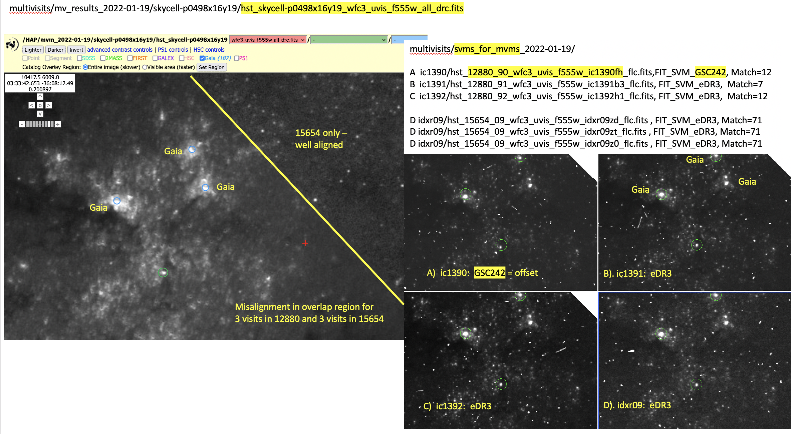
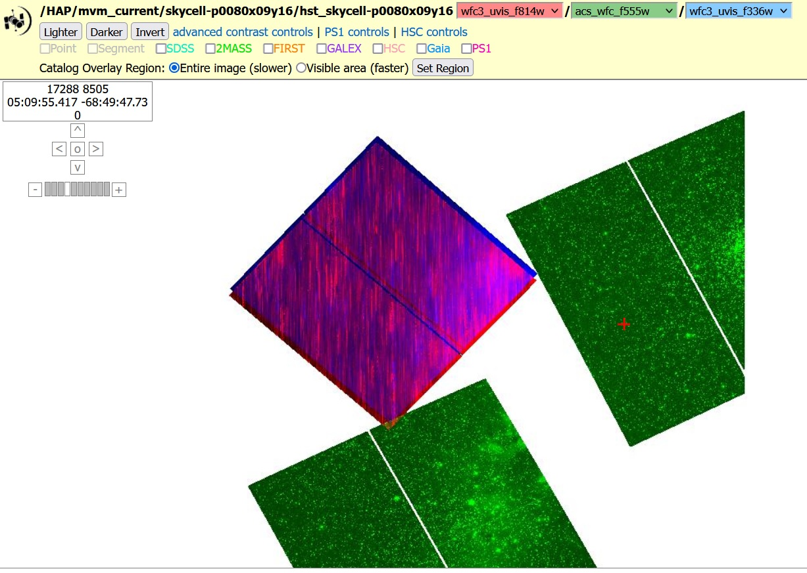

.. _multivisit_products:

=============================
Multi-visit Mosaic Products
=============================

Multi-Visit Mosaic (MVM)
    A Multi-Visit Mosaic (MVM) is a single image (product) made by combining all observations taken of the same part of the sky.

Observations taken of the same part of the sky over all the years that HST has been operational can enable unique science
due to the high-resolution of the HST cameras.  Generating useful mosaics from these observations, though, requires
solving a number of key problems; namely,

  * aligning all the images to the same coordinate system
  * define the size on the sky of each mosaic
  * defining what exposures should go into each mosaic

MVM processing implemented as part of the Hubble Advanced Products (HAP) pipeline generates new products based on
solutions implemented for these critical issues.  These new products, SkyCell layers, are unlike other HST images
due to the fact that
they consist of many exposures taken at different times, sometimes years apart.  The format of these products and
the new aspects of these products are described in the following sections.

SkyCell Layers
===============
The most basic MVM product would be the SkyCell layer as described in `Defining SkyCell Layers`_ section.  These layers
represent all the exposures taken in a given detector/filter combination in that SkyCell (position on the sky).  As a
example, the exposures for sky cell **p1889x07y19** define 9 separate layers; namely,

  * **wfc3_uvis_f475w (0.04"/pixel)** :  hst_skycell-p1889x07y19_wfc3_uvis_f475w_all_drz.fits
  * **wfc3_ir_f105w_coarse  (0.12"/pixel)** : hst_skycell-p1889x07y19_wfc3_ir_f105w_coarse-all_drz.fits
  * **wfc3_ir_f105w  (0.04"/pixel)** : hst_skycell-p1889x07y19_wfc3_ir_f105w_all_drz.fits
  * **wfc3_ir_f125w_coarse  (0.12"/pixel)** : hst_skycell-p1889x07y19_wfc3_ir_f125w_coarse-all_drz.fits
  * **wfc3_ir_f125w  (0.04"/pixel)** : hst_skycell-p1889x07y19_wfc3_ir_f125w_all_drz.fits
  * **wfc3_ir_f160w_coarse  (0.12"/pixel)** : hst_skycell-p1889x07y19_wfc3_ir_f160w_coarse-all_drz.fits
  * **wfc3_ir_f160w  (0.04"/pixel)** : hst_skycell-p1889x07y19_wfc3_ir_f160w_all_drz.fits
  * **acs_wfc_f850lp  (0.04"/pixel)** : hst_skycell-p1889x07y19_acs_wfc_f850lp_all_drc.fits
  * **acs_wfc_f775w  (0.04"/pixel)** : hst_skycell-p1889x07y19_acs_wfc_f775w_all_drc.fits

A full SkyCell would cover an area on the sky of approximately 0.2\deg x 0.2\deg with a WCS defined as:

.. code-block::

    Number of WCS axes: 2
    CTYPE : 'RA---TAN'  'DEC--TAN'
    CRVAL : 180.0  26.0
    CRPIX : 96492.0  -160812.0
    CD1_1 CD1_2  : -1.1111111111111112e-05  0.0
    CD2_1 CD2_2  : 0.0  1.1111111111111112e-05
    NAXIS : 21954  21954

SkyCell Subarray Specification
-------------------------------
SkyCell layers would normally result in arrays that take up 1.8Gb each, or nearly 4Gb for the entire FITS file.  In
addition, most of a typical SkyCell layer will be empty due to the small size of most detectors, especially the WFC3/IR,
ACS/HRC and ACS/SBC detectors which are only 1024x1024 arrays.  Each SkyCell then gets evaluated to only define a common
subarray size that covers ALL HST data for the SkyCell regardless of the layer, then uses that to define the smallest
WCS specification possible for the SkyCell.  The data from **p1889x07y19** actually only covers about 1/4 of the entire
SkyCell resulting in a WCS defined as:

.. code:: python

    >>> wcs1889 = HSTWCS('hst_skycell-p1889x07y19_acs_wfc_f775w_all_drc.fits', ext=1)
    >>> print(wcs1889)

    WCS Keywords
    Number of WCS axes: 2
    CTYPE : 'RA---TAN'  'DEC--TAN'
    CRVAL : 180.0  26.0
    CRPIX : 94360.0  -171093.0
    CD1_1 CD1_2  : -1.1111111111111e-05  0.0
    CD2_1 CD2_2  : 0.0  1.11111111111111e-05
    NAXIS : 10840  11672

We can see how the exposures land in the SkyCell as defined with this subarray WCS.

.. list-table::

  * - .. figure:: images/skycell-p1889x07y19_f775w_full.jpg
         :figwidth: 95%
         :alt: SkyCell p1889x07y19 WFC3/UVIS F775W layer.

         All the WFC3/UVIS F775W exposures that overlap SkyCell **p1889x07y19**.

    -  .. figure:: images/skycell-p1889x07y19_f105w_full.jpg
          :figwidth: 95%
          :alt: SkyCell p1889x07y19 WFC3/IR F105W layer.

          All the WFC3/IR F105W exposures that overlap SkyCell **p1889x07y19**.

These figures demonstrate how the SkyCell subarray has been defined to only cover the exposures that overlap this
SkyCell while minimizing the amount of empty space in these layers making these products as small as possible without
resorting to compression.

.. note::
  These layers are defined as subarrays of the entire SkyCell WCS, which are just subarrays of the ProjectionCell.
  As a result, any position in these layers refers to the exact same position on the sky
  as defined in the SkyCell or ProjectionCell.  A source at (x,y)=(7936, 11133) will have the same sky coordinates
  regardless of what SkyCell layer it was measured in, including an array defined for the entire SkyCell.

File Format
============

Artifacts
==========
There are a number of issues that can arise when generating SkyCell mosaics.  Every effort is made during pipeline
processing to minimize or avoid these issues where possible, but some mosaics are unavoidably affected by these issues.

Mis-alignment
--------------
One of the primary benefits of SkyCell mosaic image is learning how observations taken at different times and using
different filters relate to each other.  The mosaics all share the same pixel definitions which allow for direct
comparisons of the data across all the layers of a SkyCell.  However, the placement of the exposures in the SkyCell
depends on how the WCS was defined for each exposure.  Unfortunately, due to the objects in the field of view for an
exposure or the size of the field of view of the exposure, it may not be possible to align the exposure to the same
astrometric catalog as the rest of the exposures in the SkyCell.  This can lead to mis-alignment between the exposures
on the order of a few pixels.  If this mis-aligned exposure overlaps another exposure aligned to GAIA in a SkyCell mosaic,
then it can result in visible blurring or double-images in the final mosaic.

This can be seen when examining the SkyCell mosaic WFC3/UVIS F555W layer for SkyCell **p0498x16y19**.  The WCS has been
defined based on different astrometric catalogs for one of the visits of this source.  This results in
'blurred' sources being seen in the overlap between exposures from different visits.

         All the WFC3/UVIS F555W exposures that overlap SkyCell **p0498x16y19** illustrating
         how misalignment between visits can result in 'blurred' sources in region of overlap.
         [Image courtesy of J. Mack (STScI/ACS Instrument team)].

Loss of Lock
--------------
Another issue that can show up in SkyCell mosaics results from HST slewing across the sky while the exposures was
being taken.  This can happen when HST loses lock on the guide stars used to point the telescope or intentionally
when the proposer requested exposures be taken in 'SCAN' mode.  No reliable method currently exists to identify
such exposures prior to creating mosaics with them, resulting in exposures where the sources are trailed across
the exposures.

         SkyCell **p0080x09y16** mosaic showing the effects of loss of lock or SCAN mode data
         being included in the output image.

